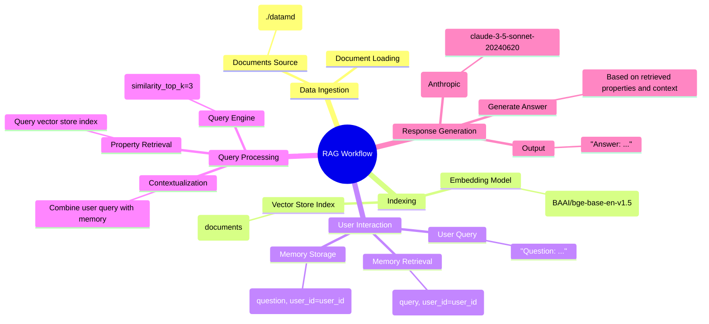
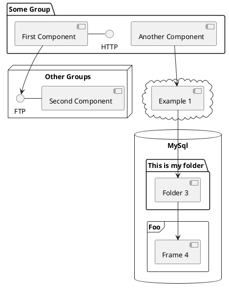

---

# RAG Concepts

You can create diagrams / graphs from textual descriptions, directly in your Markdown.

<div class="grid grid-cols-1 gap-1 pt-10 -mb-10">



</div>


---
layout: image-right
image: https://github.com/JAlcocerT/Data-Chat/blob/main/realestate/RE-bot.jpeg?raw=true
---

<!-- 
image: RE-bot.jpeg 
-->

# Implementing a RAG

See an example [here](https://github.com/JAlcocerT/Data-Chat/tree/main/LLamaIndex/With_Mem0)

<logos-claude />

<logos-openai />





---
class: px-20
---

# Do More with RAGs

RAGs can have many more use cases. From Chatting with a DB, to talk with PDF or CSV data.

<div grid="~ cols-2 gap-2" m="t-2">

```yaml
Use RAG to chat with your DataBase 
```

```yaml
Use RAG to chat with PDFs
```

<!--  -->


</div>

Read more about [RAG use cases](https://jalcocert.github.io/JAlcocerT/how-to-chat-with-your-data).

---