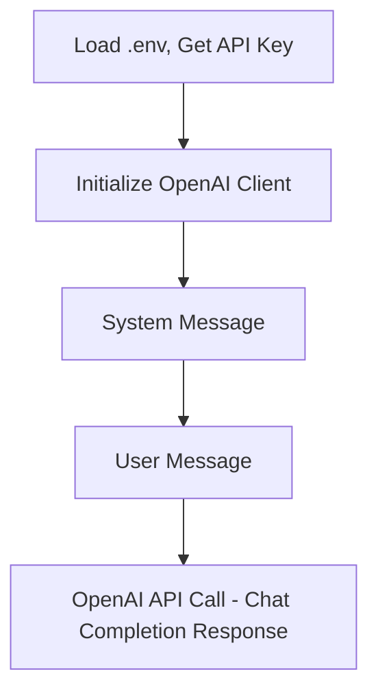
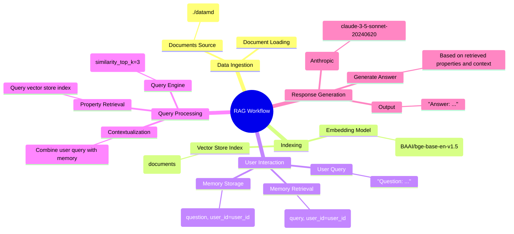
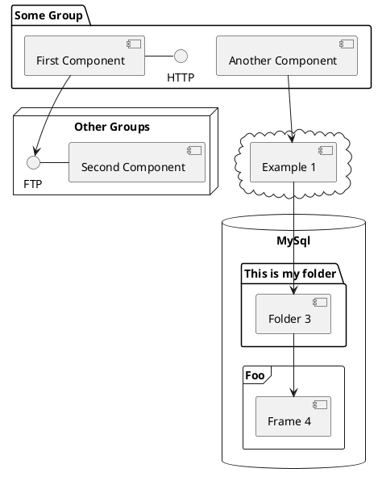

---
# You can also start simply with 'default'
theme: seriph
# random image from a curated Unsplash collection by Anthony
# like them? see https://unsplash.com/collections/94734566/slidev
background: minio.png
# some information about your slides (markdown enabled)
title: Chat with Real Estate Data
info: |
  ## Slidev Data Chat
  Using LLMs with your Data.

  Learn more at [jalcocertech.com](https://jalcocertech.com)
# apply unocss classes to the current slide
class: text-center
# https://sli.dev/features/drawing
drawings:
  persist: false
# slide transition: https://sli.dev/guide/animations.html#slide-transitions
transition: slide-left
# enable MDC Syntax: https://sli.dev/features/mdc
mdc: true
fonts:
  # basically the text
  sans: Roboto
  # use with `font-serif` css class from UnoCSS
  serif: Robot Slab
  # for code blocks, inline code, etc.
  mono: Fira Code
---

# RAG-Powered Real Estate Matching

April 4, 2025

Jesus Alcocer Tagua


<div @click="$slidev.nav.next" class="mt-12 py-1" hover:bg="white op-10">
  Let's Get Started <carbon:arrow-right />
</div>

<div class="abs-br m-6 text-xl">
  <button @click="$slidev.nav.openInEditor" title="Open in Editor" class="slidev-icon-btn">
    <carbon:edit />
  </button>
  <a href="https://github.com/JAlcocerT/Data-Chat" target="_blank" class="slidev-icon-btn">
    <carbon:logo-github />
  </a>
</div>

<!--
The last comment block of each slide will be treated as slide notes. It will be visible and editable in Presenter Mode along with the slide. [Read more in the docs](https://sli.dev/guide/syntax.html#notes)
-->


---
layout: two-cols
layoutClass: gap-16
transition: fade-out
---

# Table of contents


* **Intro:** 🚀 AI in Real Estate & Personalized Recommendations 🎯
* **API Calls:** 📞 Basic Matching (👍 Pros & 👎 Cons)
* **RAG:** 🧠 Advanced Personalization & 📈 Real-Time Data
* **Comparison:** ⚖️ API vs. RAG Use Cases
* **Demo:** 🎬 Client Matching - API vs. RAG
* **Conclusions**
* **Q&A** 🗣️

::right::

<Toc text-sm minDepth="1" maxDepth="2" />

<style>
h1 {
  background-color: #2B90B6;
  background-image: linear-gradient(45deg, #4EC5D4 10%, #146b8c 20%);
  background-size: 100%;
  -webkit-background-clip: text;
  -moz-background-clip: text;
  -webkit-text-fill-color: transparent;
  -moz-text-fill-color: transparent;
}
</style>

---
layout: image-right
image: https://github.com/JAlcocerT/Data-Chat/blob/main/realestate/RE-bot-ppt.jpeg?raw=true
---

<!-- 
#image: RE-bot-ppt.jpeg
 -->

# The Goal

Creating a Real Estate Agent to propose the best solution to property seekers.

<!-- {width=300px lazy} -->

<div v-click>

While understanding:

1. How to provide context to LLMs via API calls

</div>

<div v-click>

2. How to setup a RAG as Real Estate Agent

</div>

<br>

<v-click>

By the end of the, we will have a recap with  <span v-mark.red="3"><code>Pros and </code>Cons</span>
of each approach.

<span v-mark.circle.orange="4">Code and Demo</span>
, will also be shared.

</v-click>

<div mt-20 v-click>

[See the Code](https://github.com/JAlcocerT/Data-Chat/tree/main/Z_DeployMe)

</div>


---
src: ./pages/code-llm-api-rag.md
hide: false
---


---
class: px-20
---

# Do More with RAGs

RAGs can have many more use cases. From Chatting with a DB, to talk with PDF or CSV data.

<div grid="~ cols-2 gap-2" m="t-2">

```yaml
Use RAG to chat with your DataBase 
```

```yaml
Use RAG to chat with PDFs
```

<!--  -->


</div>

Read more about [RAG use cases](https://jalcocert.github.io/JAlcocerT/how-to-chat-with-your-data).

---

# Clicks Animations

You can add `v-click` to elements to add a click animation.

<div v-click>

This shows up when you click the slide:

```html
<div v-click>This shows up when you click the slide.</div>
```

</div>

<br>

<v-click>

The <span v-mark.red="3"><code>v-mark</code> directive</span>
also allows you to add
<span v-mark.circle.orange="4">inline marks</span>
, powered by [Rough Notation](https://roughnotation.com/):

```html
<span v-mark.underline.orange>inline markers</span>
```

</v-click>

<div mt-20 v-click>

[Learn more](https://sli.dev/guide/animations#click-animation)

</div>


---

# Diagrams

You can create diagrams / graphs from textual descriptions, directly in your Markdown.

<div class="grid grid-cols-2 gap-1 pt-10 -mb-10">






</div>

Learn more: [Mermaid Diagrams](https://sli.dev/features/mermaid) and [PlantUML Diagrams](https://sli.dev/features/plantuml)


---
layout: image-right
image: https://github.com/JAlcocerT/Data-Chat/blob/main/realestate/RE-bot.jpeg?raw=true
---
<!-- 
image: RE-bot.jpeg 
-->


# Implementing a RAG

See an example [here](https://github.com/JAlcocerT/Data-Chat/tree/main/LLamaIndex/With_Mem0)

<logos-claude />

<logos-openai />





---
src: ./pages/references.md
hide: false
---

---
src: ./pages/thanks-qna.md
hide: false
---


<!-- <PoweredBySlidev mt-10 /> -->